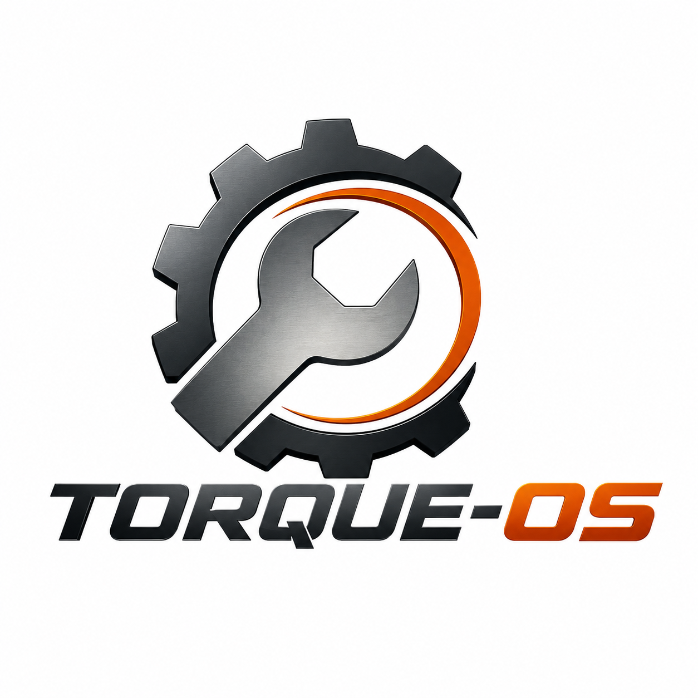

<p align="center">
  
</p>

# mechanics-infra-db

Terraform module that provisions the managed PostgreSQL database (**AWS RDS PostgreSQL 16**) for the Torque-OS Mechanics Software platform.

> **Part of the [Torque-OS](https://github.com/Torque-OS) platform** — see [how repos link together](#platform-overview) below.

---

## Platform Overview

```
Internet
  │
  └─ API Gateway (HTTP API v2)         ← mechanics-infra-k8s
        │
        ├── POST /auth  ── Lambda CPF Auth    ← mechanics-lambda
        │                       │
        │                       ▼
        │               RDS PostgreSQL 16     ← YOU ARE HERE
        │
        └── ANY /{proxy+} ── Lambda Authorizer  ← mechanics-lambda
                  │ (JWT valid)
                  ▼
               VPC Link ── NLB ── EKS Pods    ← mechanics-software
                                      │
                                      ▼
                               RDS PostgreSQL 16   ← YOU ARE HERE
```

**This repo provisions the RDS instance used by two consumers:**

| Consumer | What it reads |
|---|---|
| `mechanics-lambda` | Looks up customers by CPF for token issuance |
| `mechanics-software` | All application data (service orders, vehicles, parts…) |

---

## What This Repo Does

- Creates a **PostgreSQL 16** RDS instance (`db.t3.micro`) inside the private subnets of the EKS VPC.
- Creates a **DB Subnet Group** spanning the three private subnets.
- Creates a **Security Group** that allows port 5432 only from within the VPC CIDR (`10.0.0.0/16`) — the database is never exposed to the internet.
- Reads the VPC and subnets from the state created by `mechanics-infra-k8s` via tag lookup (no shared Terraform state required).

---

## Prerequisites

| Tool | Version | Notes |
|---|---|---|
| [Terraform](https://developer.hashicorp.com/terraform/downloads) | ≥ 1.7 | `brew install terraform` |
| [AWS CLI](https://aws.amazon.com/cli/) | ≥ 2 | `brew install awscli` |
| AWS credentials | — | See [AWS Academy setup](#aws-academy-setup) |
| `mechanics-infra-k8s` applied | Pass 1 | VPC and private subnets must exist before this apply |

---

## AWS Academy Setup

AWS Academy Learner Lab issues **temporary credentials** that expire every ~4 hours and require `aws_session_token`. Every time you start or restart a lab session:

1. Open **AWS Academy → Learner Lab → AWS Details → AWS CLI**.
2. Copy the three-line credentials block.
3. Paste into `~/.aws/credentials`:

```ini
[default]
aws_access_key_id     = ASIA...
aws_secret_access_key = ...
aws_session_token     = ...
```

> All Terraform commands and the CI/CD pipeline use `us-east-1`.

---

## Deploy Order

This repo **depends on `mechanics-infra-k8s`** (pass 1) being applied first, because it reads the VPC ID and private subnet IDs by tag:

```hcl
data "aws_vpc" "eks" {
  tags = { Name = var.cluster_name }
}

data "aws_subnets" "private" {
  filter { name = "vpc-id"; values = [data.aws_vpc.eks.id] }
  tags   = { "kubernetes.io/role/internal-elb" = "1" }
}
```

Correct order across the platform:

```
1. mechanics-infra-k8s  apply (pass 1 — cluster only, no gateway)
2. mechanics-infra-db   apply  ← this repo
3. mechanics-lambda     merge → CI/CD deploys both Lambda functions
4. mechanics-software   merge → CI/CD deploys the app to EKS
5. mechanics-infra-k8s  apply (pass 2 — enable_api_gateway=true)
```

---

## Usage

### 1. Initialize

```bash
terraform init
```

### 2. Plan

```bash
terraform plan -var="db_password=YourSuperSecretPassword123!"
```

Review the plan. It should create:
- `aws_db_subnet_group.this`
- `aws_security_group.rds`
- `aws_db_instance.this`

> **First apply takes 5–10 minutes** — RDS provisioning is slow.

### 3. Apply

```bash
terraform apply -var="db_password=YourSuperSecretPassword123!"
```

### 4. Get the connection details

```bash
terraform output db_endpoint   # e.g. mechanics-software.xxxx.us-east-1.rds.amazonaws.com:5432
terraform output db_name       # mechanicssoftware
```

### 5. Build the connection string

The full connection strings for each consumer:

```
# mechanics-software (ASP.NET Core — EF Core format)
Host=<db_endpoint>;Port=5432;Database=mechanicssoftware;Username=mechanic_admin;Password=<db_password>

# mechanics-lambda (Node.js pg — URL format)
postgresql://mechanic_admin:<db_password>@<db_endpoint>/mechanicssoftware
```

### 6. Store the connection string as a Kubernetes Secret

After applying, update the K8s secret in the `mechanics-software` repo:

```bash
# In the mechanics-software repo
kubectl create secret generic mechanics-secrets \
  --namespace mechanics-software \
  --from-literal=ConnectionStrings__DefaultConnection="Host=<db_endpoint>;Port=5432;Database=mechanicssoftware;Username=mechanic_admin;Password=<db_password>" \
  --from-literal=JWT_SECRET="<same-as-mechanics-lambda>" \
  --from-literal=GATEWAY_KEY="<same-as-infra-k8s>" \
  ...
  --dry-run=client -o yaml | kubectl apply -f -
```

Or set `DATABASE_URL` in the GitHub secrets of `mechanics-software` and let the deploy pipeline render `k8s/secret.yaml`.

---

## Variables

| Variable | Description | Default | Required |
|---|---|---|---|
| `aws_region` | AWS region | `us-east-1` | No |
| `cluster_name` | EKS cluster name — used to find the VPC by `Name` tag | `mechanics-software` | No |
| `db_name` | PostgreSQL database name | `mechanicssoftware` | No |
| `db_username` | Master username | `mechanic_admin` | No |
| `db_password` | Master password | — | **Yes** |
| `db_instance_class` | RDS instance type | `db.t3.micro` | No |
| `db_allocated_storage` | Disk size in GB | `20` | No |

Never commit `db_password` to version control. Pass it via:

```bash
# Interactively (Terraform prompts)
terraform apply

# Env var (CI/CD)
export TF_VAR_db_password="..."
terraform apply
```

---

## Outputs

| Output | Description |
|---|---|
| `db_endpoint` | Full endpoint with port (e.g. `host:5432`) |
| `db_port` | `5432` |
| `db_name` | Database name |
| `connection_string` | Partial connection string without password (sensitive — use `terraform output -raw connection_string`) |

---

## CI/CD

GitHub Actions pipeline (`.github/workflows/ci-cd.yml`):

| Trigger | Jobs |
|---|---|
| Pull Request → `main` | `terraform fmt -check` + `terraform validate` + `terraform plan` |
| Push → `main` (merge) | `terraform apply -auto-approve` |

### Secrets required in this repo

| Secret | Description |
|---|---|
| `AWS_ACCESS_KEY_ID` | AWS Academy key |
| `AWS_SECRET_ACCESS_KEY` | AWS Academy secret |
| `AWS_SESSION_TOKEN` | AWS Academy session token (rotate each lab session) |
| `DB_PASSWORD` | Master database password |

### Setting secrets

```bash
gh secret set AWS_ACCESS_KEY_ID     --repo Torque-OS/mechanics-infra-db
gh secret set AWS_SECRET_ACCESS_KEY --repo Torque-OS/mechanics-infra-db
gh secret set AWS_SESSION_TOKEN     --repo Torque-OS/mechanics-infra-db
gh secret set DB_PASSWORD           --repo Torque-OS/mechanics-infra-db
```

---

## Destroy

```bash
terraform destroy -var="db_password=YourSuperSecretPassword123!"
```

> **Warning:** `skip_final_snapshot = true` — destroy permanently deletes all data. There is no automated backup to restore from in the Learner Lab.

---

## Project Structure

```
main.tf        # RDS instance, subnet group, security group
variables.tf
outputs.tf
providers.tf
versions.tf
```

---

## Related Repositories

| Repo | Role in the platform |
|---|---|
| [mechanics-software](https://github.com/Torque-OS/mechanics-software) | Main API — reads this DB for all application data |
| [mechanics-lambda](https://github.com/Torque-OS/mechanics-lambda) | CPF auth Lambda — reads `customers` table |
| [mechanics-infra-k8s](https://github.com/Torque-OS/mechanics-infra-k8s) | VPC + EKS + API Gateway — **must be applied first** |
